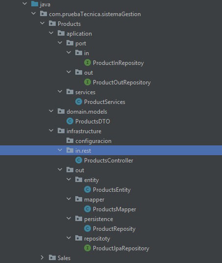

# Daniel_Beltran_java_campus

Daniel_Beltran_java_campus
Estructura del proyecto
El proyecto está estructurado en módulos principales y carpetas siguiendo una arquitectura limpia y organizada:

Módulos principales
Products

Sales

Cada módulo está dividido en las siguientes carpetas:

1. Application
   Contiene la lógica de aplicación y se divide en dos subcarpetas:

port: Contiene las interfaces de entrada y salida (puertos).

services: Implementación de los servicios del módulo.

2. Domain
   Contiene los modelos o DTOs (Data Transfer Objects) que representan las entidades del dominio.

3. Infrastructure
   Se encarga de la infraestructura y está dividida en:

in
Contiene el controlador REST (la capa que expone los endpoints).

out
Contiene varios paquetes relacionados con la persistencia y manejo de datos:

entity: Clases que representan las tablas de la base de datos con sus respectivos campos.

mapper: Clases encargadas de mapear la información necesaria tanto para guardar como para mostrar.

repository: Implementación de la lógica de cada método para manejar la persistencia.

repository interface: Interfaces que extienden JPA para realizar transacciones y consultas necesarias para alimentar la lógica.

4. Shared
   Contiene clases y recursos compartidos entre módulos, como: Excepciones personalizadas y clases de manejo de respuesta.
5. Se utilizo base de datos mysql.
6. Json Guardar Product
   {
   "name": "Acetaminofen kist",
   "sku": "M02",
   "price":2.000,
   "stockQuantity": 4,
   "categoryName": "Medicamentos"
   }
7. json guardar ventas: {
   "idClients": "Prueba",
   "productId": 1,
   "quantity": 2
   }

